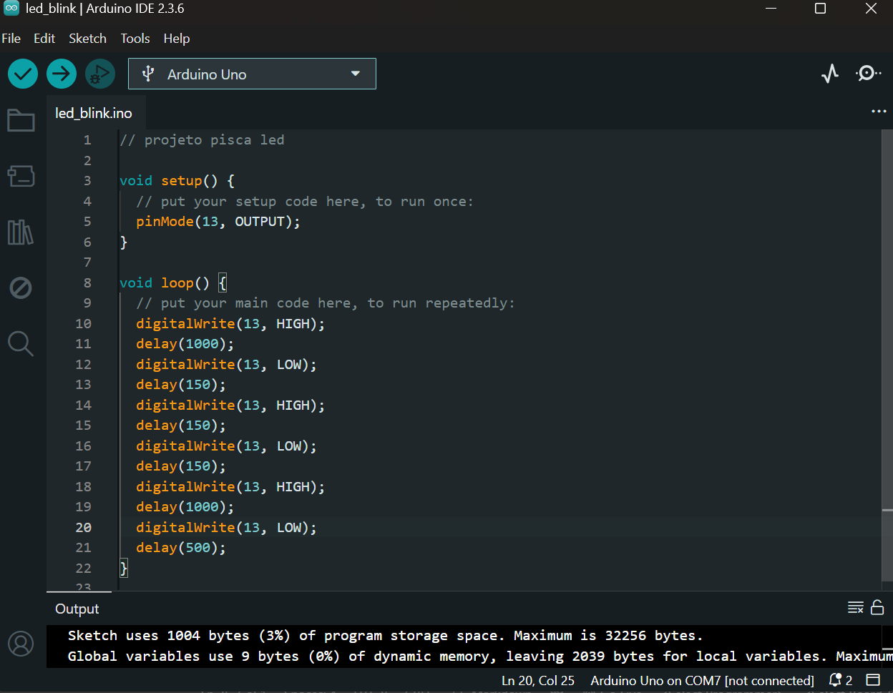
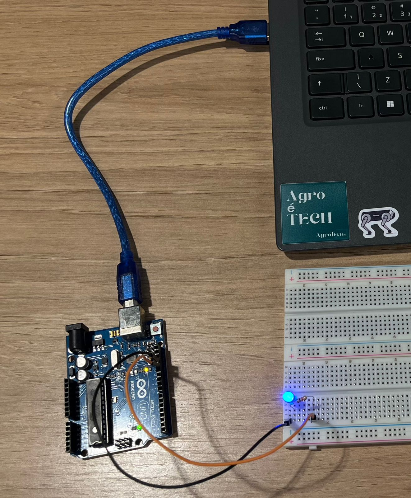
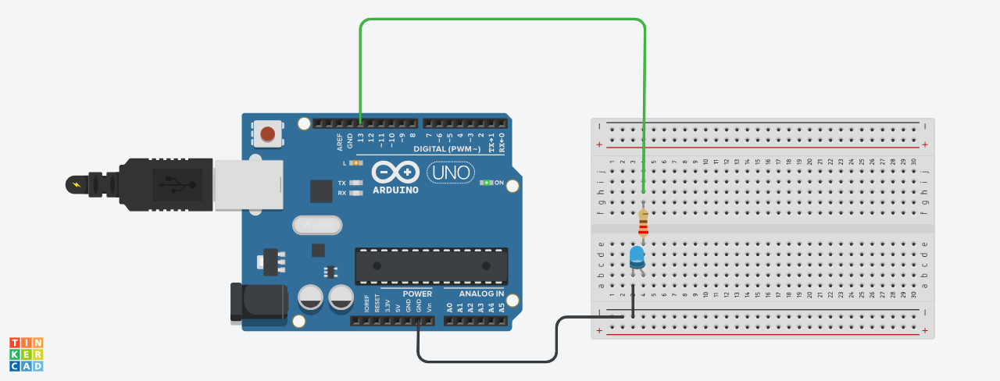
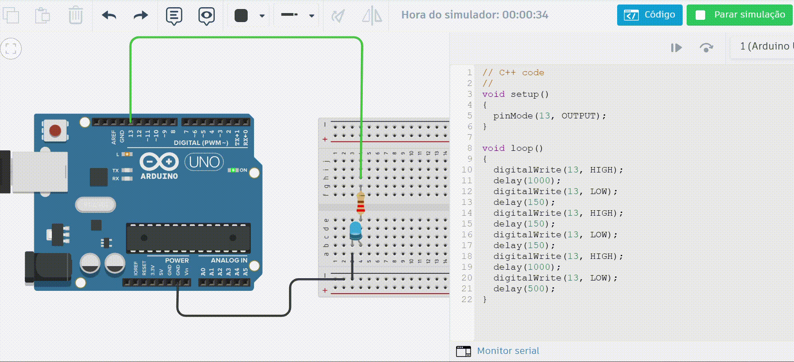

# 💡 Atividade Arduino — Blink LED

Repositório criado para as atividades práticas de **pisca-pisca (Blink)** com Arduino, realizadas durante o módulo de eletrônica e programação embarcada.


## 🔹 Parte 1: Blink LED Interno

Nesta parte, foi realizado o clássico **Blink** utilizando o **LED interno do Arduino (pino 13)**.  
O programa faz o LED acender por um tempo, apagar e aguardar alguns segundos, repetindo esse ciclo continuamente.

### 🧠 Objetivo
- Configurar o ambiente de desenvolvimento (Arduino IDE);
- Compreender o funcionamento básico de um loop no Arduino;
- Fazer o LED interno piscar com um intervalo personalizado.

### ⚙️ Código Utilizado
```c
// projeto pisca led

void setup() {
  // put your setup code here, to run once:
  pinMode(13, OUTPUT); // Define pino 13 como saída
}

void loop() {
  // put your main code here, to run repeatedly:
  digitalWrite(13, HIGH); // Liga o LED
  delay(1000); // Aguarda o tempo determinado
  digitalWrite(13, LOW); // Desliga o LED
  delay(150);
  digitalWrite(13, HIGH);
  delay(150);
  digitalWrite(13, LOW);
  delay(150);
  digitalWrite(13, HIGH);
  delay(1000);
  digitalWrite(13, LOW);
  delay(500);
}
```

O arquivo com o código também pode ser encontrado em: [código](led_blink.ino).

##### 💻 Screenshot do código na Arduino IDE


##### 🔌 Foto do Arduino conectado e LED aceso


##### 🎥 Vídeo demonstrando o funcionamento


## 🔹 Parte 2: Simulando Blink Externo (TinkerCad)

Simulação de um LED externo piscando utilizando o TinkerCad Circuits, com Arduino Uno, protoboard, LED, resistor e fios de conexão.

### 🧠 Objetivo
- Montar um circuito físico simulado com LED externo;
- Compreender o uso de portas digitais;
- Usar `pinMode()` e `digitalWrite()` para controlar o LED

### ⚙️ Código Utilizado

```c
// C++ code
//
void setup()
{
  pinMode(13, OUTPUT);
}

void loop()
{
  digitalWrite(13, HIGH);
  delay(1000);
  digitalWrite(13, LOW);
  delay(150);
  digitalWrite(13, HIGH);
  delay(150);
  digitalWrite(13, LOW);
  delay(150);
  digitalWrite(13, HIGH);
  delay(1000);
  digitalWrite(13, LOW);
  delay(500);
}
```
O código utilizado na parte 1 foi o mesmo utilizado na parte 2.
O arquivo com o código pode ser encontrado em: [código](led_blink.ino).

##### 🔌 Foto do TinkerCad


##### 🎥 Vídeo demonstrando o funcionamento


### 🧩 Componentes usados

- Arduino Uno
- Protoboard
- LED (off-board)
- Resistor (220Ω)
- Jumpers de conexão

### 🔗 Links

🔗 **Projeto no TinkerCad:** [projeto](https://www.tinkercad.com/things/2vS6qZP6zsx/editel?sharecode=GxjVbPeX-PSrihU1FwcvG0dtj7ViH2wngF_RkmdpAfI)