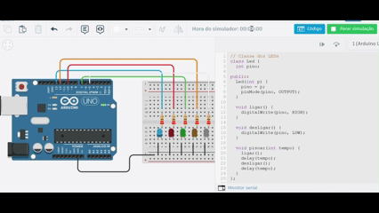

# 💡 Projeto de Circuito com POO 

## 🎯 Descrição do Projeto

Este projeto foi desenvolvido como parte da atividade de Programação Orientada a Objetos (P.O.O.) utilizando o **Arduino UNO** no **Tinkercad**.  
O circuito demonstra o uso de **classes em C++** para controlar LEDs de forma organizada e modular.

O código faz os LEDs piscarem em sequência, criando um padrão visual dinâmico e simples de entender.

## ⚙️ Componentes Utilizados
- 1x Arduino UNO  
- 5x LEDs (cores variadas)  
- 5x Resistores de 220 Ω  
- 1x Protoboard  
- Jumpers para conexões  

## 🧠 Conceitos de P.O.O. Aplicados
- **Classe `Led`**: representa cada LED do circuito.  
- **Encapsulamento**: cada LED possui seus próprios métodos (`ligar()`, `desligar()`, `piscar()`).  
- **Instância de objetos**: criação de 5 objetos (`led1`, `led2`, `led3`, `led4`, `led5`) controlando diferentes pinos.  

## 🔗 Links

- **🔧 Código do Arduino IDE:** [Clique aqui para ver o código](poo.ino) 

- **🧩 Projeto no Tinkercad:** [Clique aqui para acessar o circuito](https://www.tinkercad.com/things/ixCEyo7C66i/editel?sharecode=hJIcbs0I6Q3M1sCe7ZQhKeK_lJTHZx9mC1X4VIDIVYc)

## 🎞️ Demonstração

Abaixo é possível ver um GIF do circuito em funcionamento:

