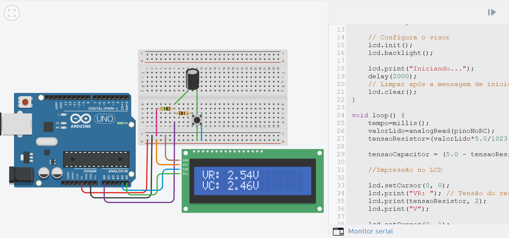
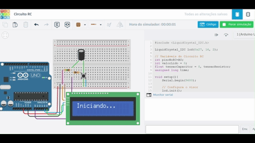
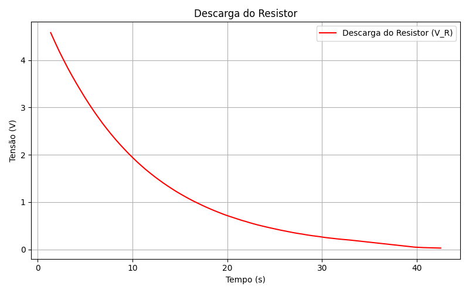
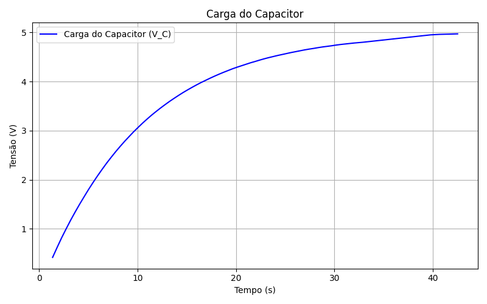
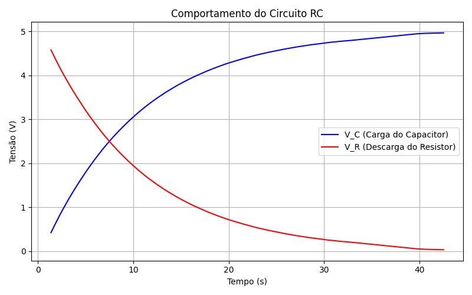

# ⚡ Circuito RC 

## 🎯 Objetivo  
Montar um circuito RC (Resistor–Capacitor) que simula o **carregamento e descarregamento de um capacitor**.  
O sistema inclui:
- Um **botão**, que reinicia o processo (faz o capacitor descarregar e o resistor recarregar);
- Um **display LCD (I2C)**, que exibe em tempo real as tensões no resistor (VR) e no capacitor (VC);
- Um **monitor serial**, para coleta dos dados e geração de gráficos.

## 🧩 Funcionamento  

- Ao **iniciar o sistema**, o resistor começa **descarregado** (VR ≈ 5V) e o capacitor **carrega progressivamente** (VC → 5V);  
- Ao **pressionar o botão**, o processo é reiniciado:  
  - O **capacitor descarrega**;  
  - O **resistor volta a carregar**.  
- O display LCD mostra continuamente os valores medidos de VR e VC.

## ⚙️ Componentes Utilizados  

| Quantidade | Componente              |
|-------------|------------------------|
| 1x          | Arduino UNO            |
| 1x          | Display LCD 16x2 (I2C) |
| 2x          | Resistor (1 MΩ e 100Ω)       |
| 1x          | Capacitor eletrolítico (10 µF) |
| 1x          | Botão (push button)    |
| 1x          | Protoboard             |
| 11x         | Jumpers                |

## 🔌 Esquemático  

📸 **Imagem do circuito no Tinkercad:**  

🎞️ **GIF do sistema em funcionamento:**  

## 🔗 Links

- **🔧 Código do Arduino IDE:** [Clique aqui para ver o código](circuito_rc.ino)  
- **🧩 Projeto no Tinkercad:** [Clique aqui para acessar o circuito](https://www.tinkercad.com/things/gpAH3TQp5AV-circuito-rc/editel?returnTo=https%3A%2F%2Fwww.tinkercad.com%2Fdashboard&sharecode=xt6krPG6bZcyQNfig0t-9sMMVOY9TW5NPoeEHS73W90)

## 📊 Resultados e Gráficos

A partir dos dados coletados no **Monitor Serial**, foram gerados os seguintes gráficos:

- Tendência de VR e VC ao longo do tempo:

- Comparativo entre VR e VC:

Os gráficos foram gerados com o código que pode ser encontrado em: [código](grafic.py).