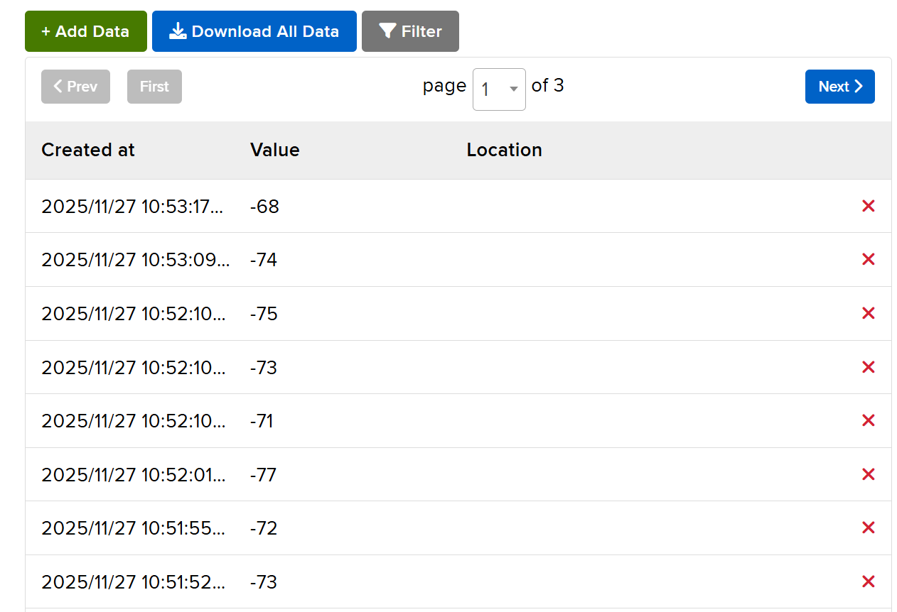
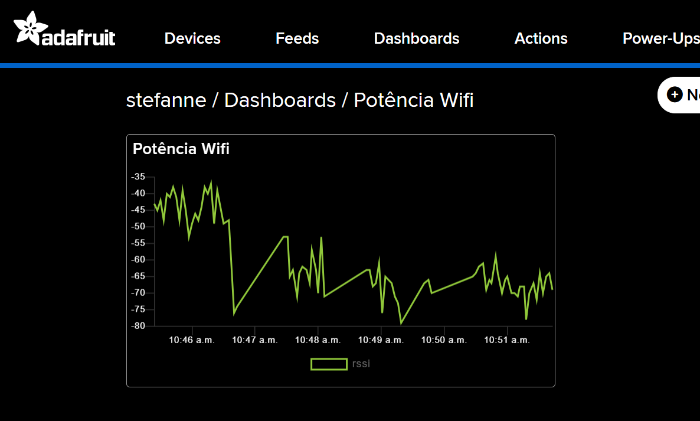
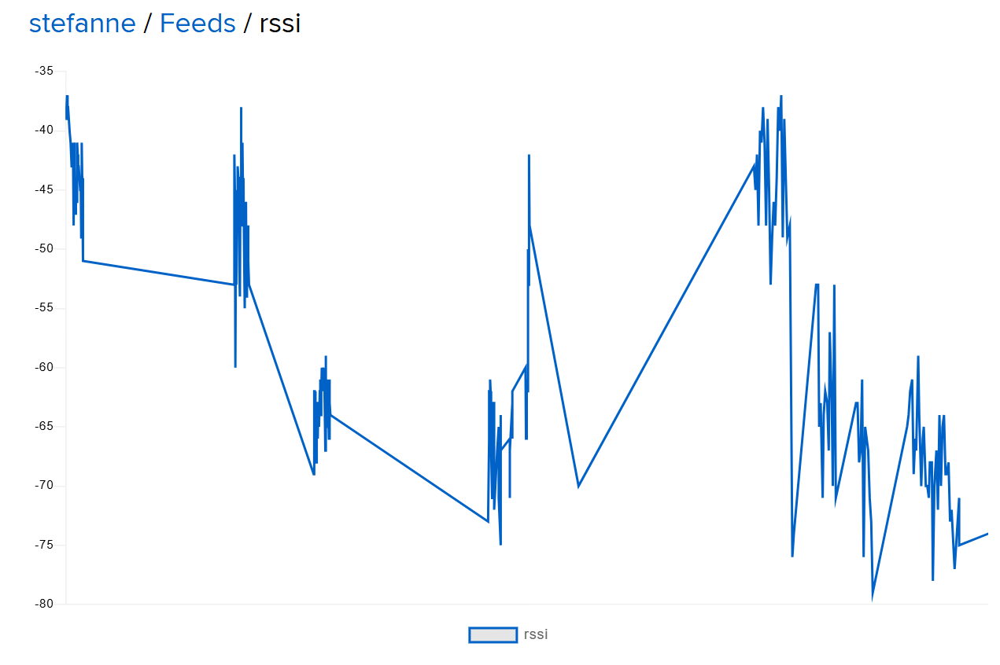

# 📡 Monitoramento de Sinal Wi-Fi 

Este projeto registra e exibe em tempo real a potência do sinal Wi-Fi (RSSI) de um ESP32 enquanto ele se movimenta pelo ambiente. A partir destes dados, foi criado um dashboard com um gráfico contínuo de dBm ao longo do tempo. Para validar o comportamento do sinal, foram realizados testes em diferentes cenários, incluindo a entrada do elevador do Inteli para simular uma gaiola de Faraday. O gráfico registra claramente a queda e a recuperação do sinal

Figura 1: Feed do Adafruit IO (dados recebidos)  
  
  Fonte: Autoral, 2025.

## 🎯 Objetivos do Projeto

- Ler o valor de RSSI do dispositivo conectado ao Wi-Fi.
- Enviar os dados continuamente para o Adafruit IO.
- Visualizar a variação no gráfico do dashboard.
- Demonstrar na prática a perda do sinal ao entrar em áreas de bloqueio, como um elevador.

## 📊 Funcionamento

O sistema envia continuamente o valor de RSSI para o feed rssi do Adafruit IO.
O dashboard recebe esses valores e atualiza o gráfico automaticamente.

Figura 2: Dashboard personalizado 
  
  Fonte: Autoral, 2025.

**Comportamentos observados:**

✔️ Fora do elevador: sinal forte e estável
✔️ Dentro do elevador: perda total da conexão
✔️ Ao sair: o dispositivo reconecta e o gráfico volta a atualizar

Figura 3: Gráfico do feed 
  
  Fonte: Autoral, 2025.

## 🎥 Vídeo da demonstração

[Clique aqui para assistir ao vídeo do funcionamento](https://youtu.be/lvjLCcqH5UA)

O vídeo mostra:

- o dispositivo funcionando fora do elevador
- a queda total da conexão ao entrar
- a reconexão automática após sair

## 🧪 Código Utilizado

O código utilizado pode ser acessado em: [código](sketch\sketch.ino).