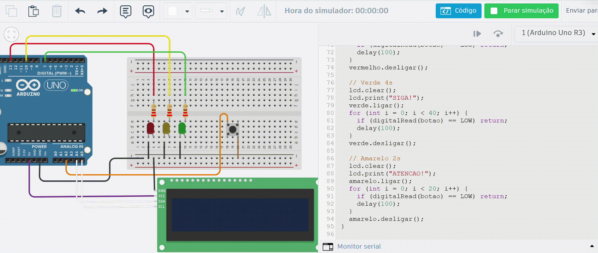
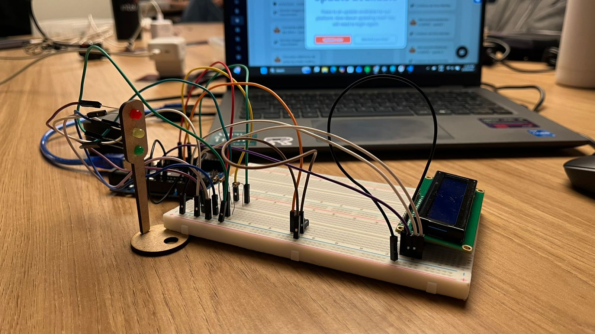

# 🚦 Semáforo Offline

## 📘 Descrição do Projeto 

O **Semáforo Offline** é um sistema que simula o funcionamento de um semáforo real utilizando Arduino Uno.

O circuito controla três LEDs (vermelho, amarelo e verde) com tempos simulados de trânsito, e conta com um botão que ativa o modo de falha, onde o semáforo entra em estado de “quebrado” (amarelo piscando).

Além disso, um display LCD I2C exibe mensagens correspondentes a cada estado do semáforo (como “PARE!”, “SIGA!”, “ATENÇÃO!”) e alerta quando o sistema está em modo de falha.

O projeto foi desenvolvido com **Programação Orientada a Objetos (POO)** e o uso de **ponteiros** para reforçar conceitos de abstração e endereçamento de memória.  

## 🧠 Objetivos de Aprendizagem  

- Aplicar conceitos de eletrônica básica, prototipagem e simulação de circuitos.
- Implementar Programação Orientada a Objetos (POO) em C++.
- Entender e aplicar ponteiros em uma aplicação real.
- Utilizar dispositivos de entrada e saída (botão e display LCD).
- Simular situações reais de sistemas embarcados, como falhas de operação.

## 🔌 Esquema de Montagem - Tinkercad

Um esquema de montagem foi realizado usando o Tinkercad para simular e testar o circuito antes de sua montagem. Abaixo é possível visualizar e acessar essa simulação:

[Clique aqui para abrir a simulação no Tinkercad](https://www.tinkercad.com/things/aVh6rwPMJQF-semaforo-offline-/editel?returnTo=https%3A%2F%2Fwww.tinkercad.com%2Fdashboard&sharecode=SSA6FalxUXp7hAhYRddWbSZtK9iDMZrXBZjJJZBkWMg).

## ⚙️ Materiais Utilizados  

| Componente                        | Quantidade | Função                         | Especificações |
| --------------------------------- | ---------- | ------------------------------ | -------------- |
| LED vermelho                      | 1          | Indica “Pare”                  | 5mm, 2V        |
| LED amarelo                       | 1          | Indica “Atenção”               | 5mm, 2V        |
| LED verde                         | 1          | Indica “Siga”                  | 5mm, 2V        |
| Resistores                        | 3          | Proteção dos LEDs              | 220Ω           |
| Botão                             | 1          | Ativa o modo de falha          | Push button    |
| Display LCD I2C                   | 1          | Mostra mensagens do sistema    | Endereço 0x27  |
| Jumpers macho-macho e macho-fêmea | Vários     | Conexões                       | —              |
| Protoboard                        | 1          | Montagem do circuito           | —              |
| Arduino Uno                       | 1          | Microcontrolador               | —              |
| MDF (simula semáforo)             | 2          | Estrutura física para os LEDs  | —              |
| Cabo USB                          | 1          | Alimentação e upload do código | —              |

## 🛠️ Etapas da Montagem  

Estes foram os passos utilizados para monstar o circuito do Semáforo Offline: 

1. Insira os LEDs (vermelho, verde e amarelo) na protoboard.

2. Coloque cada resistor de 220 Ω conectado ao terminal positivo (perna maior) de cada LED.

3. Conecte a outra ponta do resistor a uma linha livre da protoboard, onde será ligado ao pino do Arduino.

4. Ligue a linha negativa da protoboard ao GND.

5. Ligue o terminal negativo (perna menor) de cada LED à linha negativa (GND) da protoboard.

6. Use jumpers macho-macho para ligar cada resistor ao respectivo pino do Arduino:

    - LED vermelho → pino digital 13
    - LED amarelo → pino digital 10
    - LED verde → pino digital 7

    Assim, o Arduino poderá controlar cada luz do semáforo individualmente.

7. Encaixe o botão na protoboard (de forma que cada lado fique em colunas diferentes).

8. Conecte um dos terminais do botão ao pino analógico A2 do Arduino (usando um jumper macho-macho).

9. Conecte o outro terminal do botão ao GND da protoboard.

10. Posicione o display LCD sobre a protoboard, encaixando os pinos de forma firme.

11. Use jumpers macho-fêmea para conectar o display diretamente ao Arduino:

    - GND → GND
    - VCC → 5V
    - SDA → A4
    - SCL → A5

12. Fixe os LEDs em uma plaquinha de MDF (fornecida pelo professor) para simular o formato de um semáforo real.

13. Utilize jumpers macho-fêmea para conectar os LEDs da base de MDF à protoboard.

14. Conecte o cabo USB do Arduino ao computador.

15. Faça o upload do código.

Abaixo é possível visualizar a imagem do circuito físico montado.

## 💻 Código-Fonte  

📂 [Clique aqui para acessar o código utilizado.](sketch/sketch.ino) 

No código, é possível observar:

- Implementação da classe Led com métodos ligar(), desligar() e piscar().
- Uso de ponteiro para o botão: `int* ptrBotao = &botao;`
- Exibição de mensagens no LCD I2C em cada estado.

## 🧩 Funcionamento

O semáforo alterna automaticamente entre os estados:

| Cor         | Mensagem no LCD | Duração    |
| ----------- | --------------- | ---------- |
| 🔴 Vermelho | “PARE!”         | 6 segundos |
| 🟢 Verde    | “SIGA!”         | 4 segundos |
| 🟡 Amarelo  | “ATENÇÃO!”      | 2 segundos |

Se o **botão for pressionado**, o sistema entra em modo de falha, exibindo:

- LCD: “Está quebrado! / CUIDADO!”
- LED amarelo piscando continuamente
- LEDs verde e vermelho desligados

O modo normal é retomado ao soltar o botão.

## 🎥 Demonstração  

Um vídeo demonstrando o funcionamento do projeto realizado. [Clique aqui para assistir ao vídeo](https://youtube.com/shorts/bsnWfrAuo8M). 

O vídeo também está disponível na pasta do projeto: `/assets/video.mov`

O vídeo mostra:  
- O circuito físico em funcionamento. 
- O funcionamento correto dos tempos (6s vermelho, 4s verde, 2s amarelo).  
- A ativação do modo de falha via botão.
- As mensagens exibidas no LCD.

